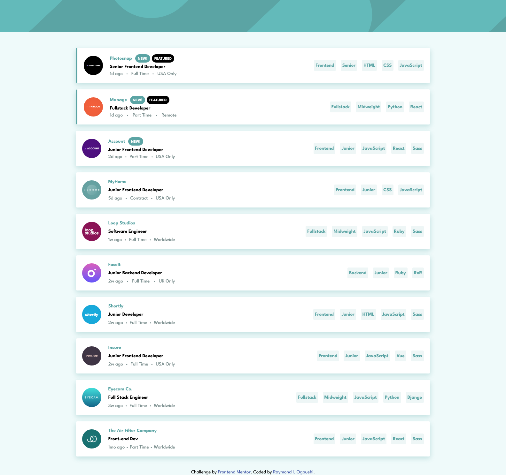

# Frontend Mentor - Job listings with filtering solution

This is a solution to the [Job listings with filtering challenge on Frontend Mentor](https://www.frontendmentor.io/challenges/job-listings-with-filtering-ivstIPCt). Frontend Mentor challenges help you improve your coding skills by building realistic projects. 

## Table of contents

- [Overview](#overview)
  - [The challenge](#the-challenge)
  - [Screenshot](#screenshot)
  - [Links](#links)
- [My process](#my-process)
  - [Built with](#built-with)
  - [What I learned](#what-i-learned)
  - [Continued development](#continued-development)
- [Author](#author)

## Overview

### The challenge

Users should be able to:

- View the optimal layout for the site depending on their device's screen size
- See hover states for all interactive elements on the page
- Filter job listings based on the categories

### Screenshot



### Links

- Solution URL: [https://github.com/Ihezie/static-job-listings.git](https://github.com/Ihezie/static-job-listings.git)
- Live Site URL: [https://static-job-listings-site.netlify.app/](https://static-job-listings-site.netlify.app/)

## My process

### Built with

- Semantic HTML5 markup
- CSS custom properties
- Flexbox
- Mobile-first workflow
- [React](https://reactjs.org/) - JS library

### What I learned

While coding the filtering functionality of this project, I learned a new array method; the 'every' method. I also got a better understanding on how to implement the useState and useEffect hooks. Generally, this project made me more comfortable using a lot a react features.

```js
  // Proud of these functions
  const checkIsSubset = (item) => {
    const { role, level, languages, tools } = item;
    const categories = [role, level, ...languages, ...tools];

    const isSubset = selectedCategories.every((selectedCategory) =>
      categories.includes(selectedCategory)
    );
    return isSubset;
  };

  const filterListings = () => {
    if (selectedCategories.length > 0) {
      const newListings = data.filter((jobListing) =>
        checkIsSubset(jobListing)
      );
      setJobListings(newListings);
    } else {
      setJobListings(data);
    }
  };
```
### Continued development
Going forward I will refine my react and js skills, so that can I build more complex projects in smaller amounts of time. Also in future projects I definitely plan use a CSS library, as styling is usually the most stressful part of my development process.

## Author
- Frontend Mentor - [@Ihezie](https://www.frontendmentor.io/profile/Ihezie)

